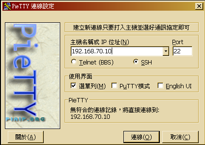
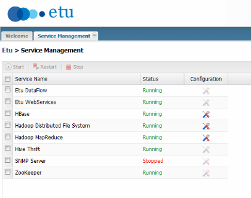
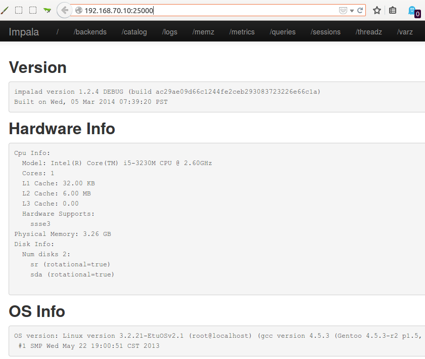

## 實作零

## 準備實作環境

### 系統需求

* 為了執行此實作練習，需要

### SSH Client

其次，我們需要一個 SSH Client，用來連上 [Etu Virtual Appliance (EVA)](http://www.etusolution.com/index.php/tw/download/eva/eva-installation-tw)

這裡筆者挑選的工具是 [PieTTY](http://ntu.csie.org/~piaip/pietty/)

1. 下載 PieTTY 免安裝版本
    * 您可以至以下網址下載最新版本： http://ntu.csie.org/~piaip/pietty/
    * 或者按下滑鼠右鍵，將 [0.3.27 版](http://ntu.csie.org/~piaip/pietty/archive/pietty0327.exe) 另存新檔，儲存於桌面。
1. 嘗試連線至 [Etu Virtual Appliance (EVA)](http://www.etusolution.com/index.php/tw/download/eva/eva-overview-tw) 的 Master 虛擬機器(若您有根據設定步驟正確設定，則 IP 位址應為 192.168.70.10)
    * 

## 前置確認作業

### 確認 HDFS 與 MapReduce 服務狀態

首先，由於 Impala 底層相依 HDFS、MapReduce 跟 Hive，因此請先確認 HDFS 與 MapReduce 的狀態是正常運作中。
以 Etu Virtual Appliance 為例，您可以連線至 <http://192.168.70.10:50070> 跟 <http://192.168.70.10:50030> 確認 NameNode 與 JobTracker 的狀態。
或者從 <http://192.168.70.10/login.html> 登入管理介面 ( 帳號: admin / 密碼: etuadmin )，點選 Service Management (如下圖)。

 

### 確認 Impala 服務狀態

接著，請確認 Impala 的狀態是否正常運作中。您可以連線至 <http://192.168.70.10:25000> 來確認 Impala 的狀態。
若您可以正常連線並看到如下圖的結果，代表 Impala 已經正常運作中。

 ◎ Impala 服務狀態

若您無法看到如上圖之狀態，代表 Impala 可能還沒啟動，或者有錯誤發生。您可以使用 SSH 連線至 Etu Virtual Appliacen，並檢查 Impala 的相關日誌檔，來進行故障排解。在 Etu Virtual　Appliance 中，日誌檔的存放位置是 /opt/impala/var/log/impala/。

<small>
<pre>
Etu Appliance version 2.0 [Kernel 3.2.21-EtuOSv2.1]
eva@etu-master ~ $ cd /opt/impala/var/log/impala/
eva@etu-master /opt/impala/var/log/impala $ ls
catalogd.etu-master.etu.log.INFO.20141221-112503.4450
catalogd.INFO
impala-catalog.log
impalad.ERROR
impalad.etu-master.etu.log.ERROR.20140421-101612.2799
impalad.etu-master.etu.log.INFO.20141221-112503.4386
impalad.etu-master.etu.log.WARNING.20141221-112513.4386
impalad.INFO
impalad.WARNING
impala-server.log
impala-state-store.log
profiles
statestored.etu-master.etu.log.INFO.20141221-112503.4414
statestored.INFO
</pre>
</small>

### 連線至 EVA

請使用 SSH Client (Ex. [PieTTY](http://ntu.csie.org/~piaip/pietty/)) 連進 EVA 的 Master 虛擬機器。(若您是參考官方步驟進行設定，則 IP 位址應為 192.168.70.10)

1. 嘗試連線至 [Etu Virtual Appliance (EVA)](http://www.etusolution.com/index.php/tw/download/eva/eva-overview-tw) 的 Master 虛擬機器(若您有根據設定步驟正確設定>，則 IP 位址應為 192.168.70.10)
    * 

--------------------
本文件最後更新於：
